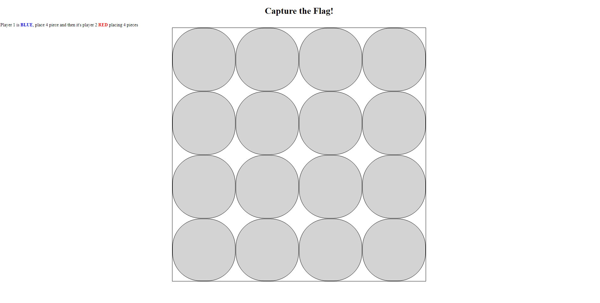
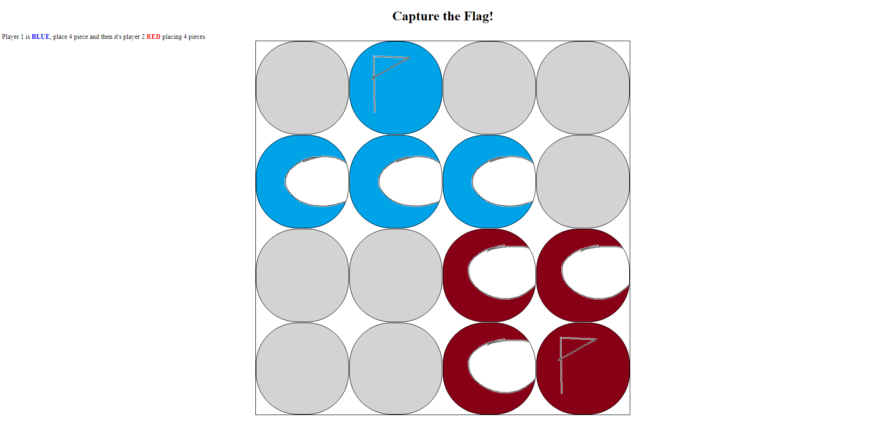
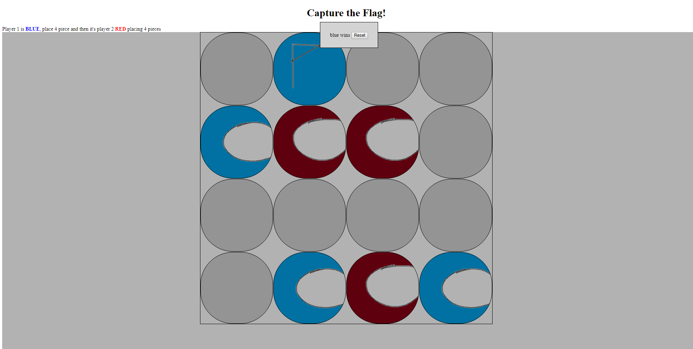

<h1> Capture The Flag! </h1>

  this project was originally going to be a some chinese based stratego game, 

but i realized it was too much for me to handle so it was scoped down to a simpler stratego game,

and that was scoped down again into the current MVP you are about to experience here.

im going to call it capture the flag,

original idea, any clash of similarities are purely coincidental. 

----------

<h2> Screenshots </h2>

 when loading up the page you will see a 4x4 board 

 at this point player1 who is BLUE will place their pieces on the board, anywhere you like 

<ul> in the order of: 
  <li> pawn </li>
  <li> pawn </li>
  <li> pawn </li>
  <li> flag </li>
</ul>

 then the second player which will be RED will place their pieces, again, anywhere you like.
    after both players have placed each of their four pieces, the game can start

 again blue will move first, click on a pawn and click on an empty tile. 

you cant run into your own flag,

you cant run into your own pawns,

and you cant run into your opponent's pawns, make love not war

the only thing you can run into is the opponent flag 

 each player will take turns moving their pieces, and try to block eachother and take opponent's flag to win 

 should be pretty obvious when someone wins, and you can reset the board to play again, not sure why you want to though 

----------
<h2> Technologies used </h2>
<ul>
  <li>JavaScript</li>
  <li>HTML</li>
  <li>CSS</li>
</ul>

----------
<a href=""> here is the link </a>
----------
<h2> Planned Features </h2>

 just a few among many

add a indicator for what phase the game is in,

indicator for which pieces the current player is placing, and the remaining pieces

indicator for selecting pieces

add confirmation for placing pieces

allow user to change their mind on placing pieces

add score keeping

give the entire thing a visual upgrade

etc... etc... etc... 

